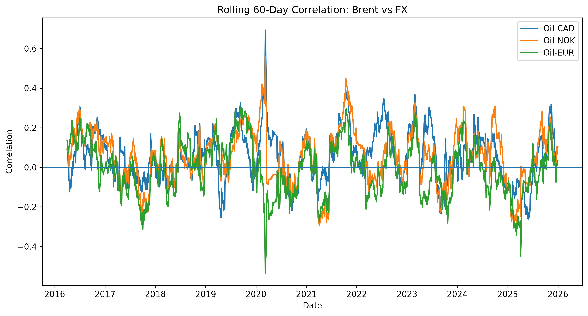

# Oil Shocks and Petro-Currency Dynamics

An empirical study of how daily Brent crude-oil moves relate to CAD, NOK, and EUR FX returns, with a focused test of whether large oil-price shocks provide a usable rule-based FX signal.

## Why this matters

Oil is an important terms-of-trade driver for commodity-exporting economies, but the transmission into FX can vary by currency, market regime, and the size of the oil move. This project separates a stable economic intuition from a trading claim: it measures the daily relationship, examines whether it changes over time, and tests whether oil shocks alone support a simple FX strategy.

## Research questions

1. How strongly do daily Brent returns co-move with CAD, NOK, and EUR FX returns?
2. Is the oil–FX relationship stable across time?
3. Do unusually large positive oil moves strengthen the CAD relationship?
4. Can oil shocks, without additional filters, create an actionable FX trading signal?

## Data and design

| Item | Specification |
|---|---|
| Sample | Daily observations, 2015–2026 |
| Oil benchmark | Brent crude oil |
| FX universe | CAD, NOK, and EUR exchange rates |
| Transformation | Daily log/percentage returns after aligning trading dates and removing missing observations |
| Core tests | Correlations, OLS regressions, rolling correlations, and shock-interaction regressions |
| Strategy test | Rule-based oil-shock signal with cumulative performance evaluation |

The empirical design uses returns rather than price levels to avoid drawing conclusions from common price trends. EUR is included as a non-petro-currency benchmark: it helps distinguish an oil-specific effect from a broad USD or risk-on/risk-off move.

## Methodology

### 1. Return and correlation analysis

Daily Brent and FX return series are aligned on common dates. Contemporaneous correlations provide a first-pass view of co-movement.

### 2. Baseline sensitivity regression

For each currency, daily FX returns are regressed on daily Brent returns:

```text
FX return_t = alpha + beta × Brent return_t + error_t
```

The coefficient `beta` measures the average same-day oil sensitivity. The model's R-squared is reported alongside statistical significance, since a statistically detectable relationship may still have little day-to-day explanatory power.

### 3. Time variation

Rolling correlations assess whether the relationship is stable or regime-dependent. This matters more for markets than a single full-sample coefficient: a modest average beta can conceal periods of stronger or weaker transmission.

### 4. Oil-shock interaction test

The CAD regression is extended with an indicator for extreme positive oil-return days and its interaction with the oil return. The interaction tests whether CAD's oil sensitivity is materially higher during positive shocks.

### 5. Trading-strategy sanity check

A transparent, rule-based strategy translates large oil moves into an FX signal and evaluates cumulative performance. It is intended as a robustness and economic-significance check—not as an optimised production strategy.

## Key findings

| Finding | Evidence | Markets interpretation |
|---|---|---|
| CAD is the most oil-sensitive currency in this sample | CAD has the strongest estimated relationship with Brent among the tested currencies | Consistent with Canada’s oil-exporter exposure, but not sufficient by itself for daily forecasting |
| The average effect is economically small | Brent explains less than 1% of CAD’s day-to-day return variation | Oil is one input to CAD, alongside rates, broad USD moves, risk sentiment, positioning, and domestic data |
| NOK and EUR show no meaningful daily link in this setup | Estimated relationships are not statistically meaningful | A petrocurrency narrative does not automatically translate into a simple daily return signal |
| Positive oil shocks do not materially amplify CAD sensitivity | Shock-interaction term is not statistically significant (`p ≈ 0.30`) | Large positive oil days alone do not provide evidence of a stronger, reliable CAD response |
| The relationship is time-varying | Rolling correlation analysis varies across the sample | Any practical signal should be regime-aware and combined with complementary market variables |

## Selected outputs

### Rolling oil–FX correlation



*Use this figure to show the time-varying relationship rather than claiming a constant beta.*

### Regression summary

Replace the placeholders below with the exact notebook outputs before publishing. A compact table is better than inventing a beta-over-time chart.

| Dependent FX return | Brent beta | p-value | R-squared | Takeaway |
|---|---:|---:|---:|---|
| CAD | `[insert]` | `[insert]` | `< 1%` | Strongest relationship in the sample, but weak as a standalone daily forecast |
| NOK | `[insert]` | `[insert]` | `[insert]` | No statistically meaningful daily relationship in this specification |
| EUR | `[insert]` | `[insert]` | `[insert]` | Benchmark relationship is not statistically meaningful |

### Strategy performance


*The strategy is a diagnostic: results should be assessed after transaction costs, drawdowns, turnover, and out-of-sample validation.*

## What the analysis does—and does not—claim

- It supports a modest, time-varying oil–CAD relationship in the tested sample.
- It does not support oil as a standalone daily FX forecasting factor.
- It does not establish causality: common drivers such as USD strength, global growth, rates, and risk sentiment may affect both oil and FX.
- It does not treat the rule-based strategy as investable without costs, risk controls, and out-of-sample testing.

## Repository structure

```text
oil-shocks-fx-analysis/
├── README.md
├── requirements.txt
├── notebooks/
│   ├── 01_oil_fx_analysis.ipynb
│   └── 02_oil_shocks_trading_strategy.ipynb
├── figures/
│   ├── rolling_correlation.png
│   ├── regression_summary.png             # optional; omit if the table above is sufficient
│   └── strategy_performance.png
└── data/
    └── README.md                           # data source links and download instructions; do not upload licensed/raw data by default
```

## Reproducibility

```bash
pip install -r requirements.txt
jupyter notebook notebooks/01_oil_fx_analysis.ipynb
```

Typical dependencies: `pandas`, `numpy`, `matplotlib`, `statsmodels`, and `jupyter`.

## Next steps

- Add rate differentials, broad USD, equity-volatility, and risk-sentiment controls.
- Test lagged oil returns and clearly separate in-sample from out-of-sample results.
- Report Sharpe ratio, maximum drawdown, turnover, and transaction-cost sensitivity for the strategy.
- Extend the currency set and test alternative oil benchmarks.

---

This project is for research and educational purposes only; it is not investment advice.
