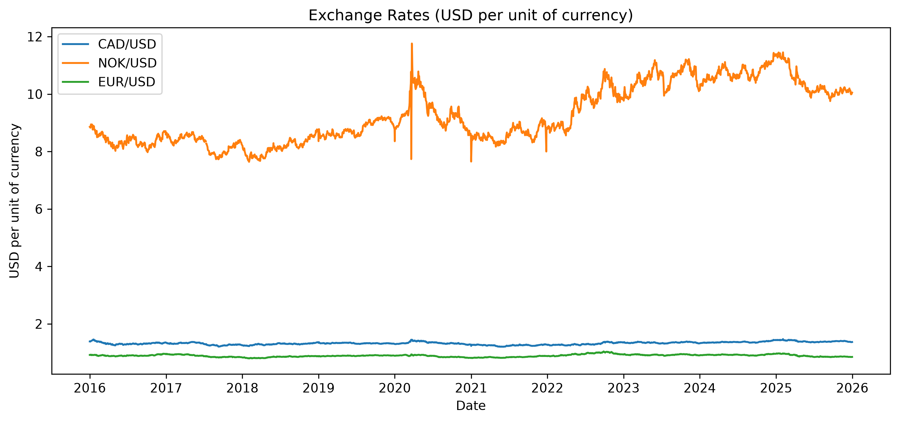

# Oil Shocks and Petro-Currency Dynamics

## Overview

This project investigates how crude oil price shocks transmit into commodity-linked currencies, focusing on CAD and NOK against major currencies.

Using historical Brent crude oil and FX data, the analysis examines whether oil price movements generate persistent relationships with petro-currencies.

## Research Questions

- How strongly are CAD and NOK affected by oil price movements?
- 
- Does oil-FX sensitivity change during different market regimes?

- Can oil shocks generate actionable FX trading signals?

## Methodology

- Data: Daily Brent crude oil prices and FX exchange rates
- Period: 2015-2026
- Tools: Python (pandas, NumPy, statsmodels, matplotlib)

Methods:
- Return analysis
- Rolling correlation analysis
- Regression modelling
- Oil shock identification
- Rule-based trading strategy

## Key Findings

- CAD behaves most like a petrocurrency in the model, but the effect is small.
- Oil alone explains less than 1% of CAD’s day-to-day moves, so it is not a useful standalone daily FX forecasting factor.
- NOK and EUR show no statistically meaningful daily association with Brent in this setup.
- Extreme positive oil days did not materially strengthen the CAD relationship: the shock-interaction term was not statistically significant (p ≈ 0.30).

## Future Extensions

- Optimise trading strategy
- Incorporate volatility indicators
- Test additional commodity currencies (JPY, an oil-importing country)
- Improve risk-adjusted strategy evaluation
